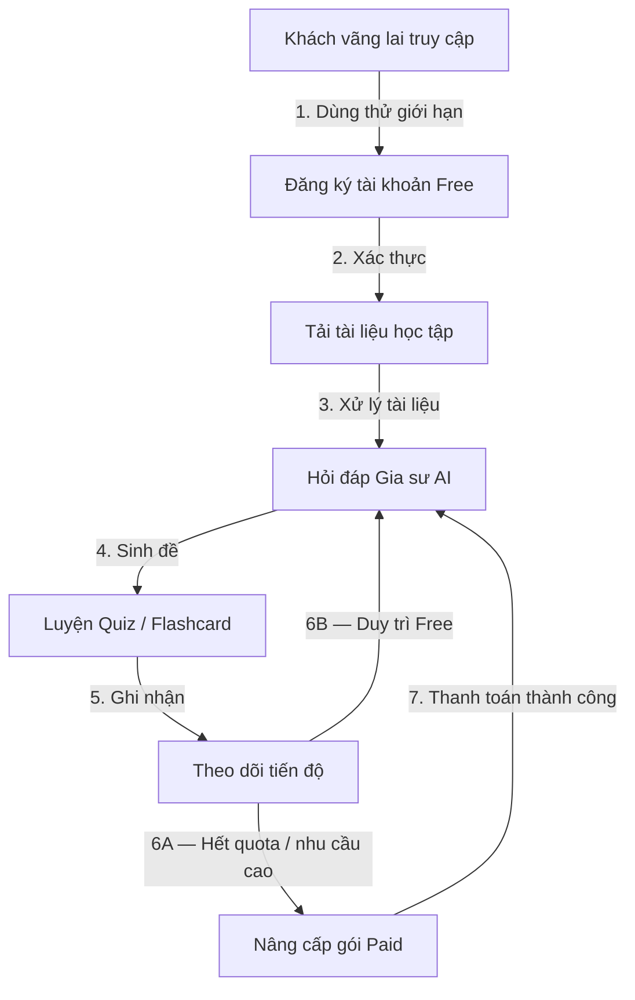

# Bức Tranh Nghiệp Vụ Tổng Quát (01-nghiep_vu_tong_quat.md)

## 1. Chuỗi Giá Trị End-to-End

## 2. Bản Đồ Capability ➔ Module

| Capability | Thư mục nghiệp vụ con | Use Case lõi |
| :--- | :--- | :--- |
| Xác thực, quản lý người dùng | `01-xac-thuc-va-quan-ly-nguoi-dung/` | Đăng ký, đăng nhập, quản lý hồ sơ, phân vai |
| Tài liệu học tập | `02-quan-ly-tai-lieu-hoc-tap/` | Tải lên, xem, gắn thẻ, xóa/lưu trữ |
| Gia sư AI | `03-gia-su-ai-hoi-dap/` | Hỏi đáp theo ngữ cảnh, trích dẫn nguồn, báo cáo sai |
| Quiz/Flashcard | `04-luyen-tap-quiz-flashcard/` | Sinh bộ câu hỏi bằng AI, luyện tập, chấm điểm |
| Gói và thanh toán | `05-goi-dich-vu-thanh-toan-va-han-muc/` | Xem gói, mua/gia hạn, kiểm tra quota, hoàn tiền |
| Tiến độ | `06-theo-doi-tien-do-va-bao-cao/` | Ghi nhận hoạt động, streak, báo cáo tuần |

## 3. Đối Tượng Nghiệp Vụ Trung Tâm & Lifecycle

- `UserAccount`: `GUEST` ➔ `ACTIVE_FREE` ➔ `ACTIVE_PAID` ➔ `SUSPENDED` / `DELETED`.
- `LearningDocument`: `UPLOADING` ➔ `PROCESSING` ➔ `READY` ➔ `ARCHIVED` / `DELETED`.
- `AIConversation`: `ACTIVE` ➔ `ARCHIVED`.
- `QuizAttempt`: `DRAFT` ➔ `IN_PROGRESS` ➔ `SUBMITTED` ➔ `SCORED`.
- `Subscription`: `TRIAL/FREE` ➔ `PENDING_PAYMENT` ➔ `ACTIVE` ➔ `EXPIRING` ➔ `EXPIRED` / `CANCELLED`.
- `StudyProgress`: cập nhật cộng dồn theo sự kiện học tập.

## 4. Nguyên Tắc Xuyên Suốt

- Mọi hành vi AI tốn chi phí đều kiểm tra quota trước khi gọi `LLM`.
- Mọi giao dịch tiền đều có idempotency và đối soát.
- Dữ liệu học tập riêng tư theo mặc định, nhật ký kiểm toán cho hành vi nhạy cảm.
- Múi giờ nghiệp vụ: `Asia/Ho_Chi_Minh`, ngày quota cắt lúc 00:00.
