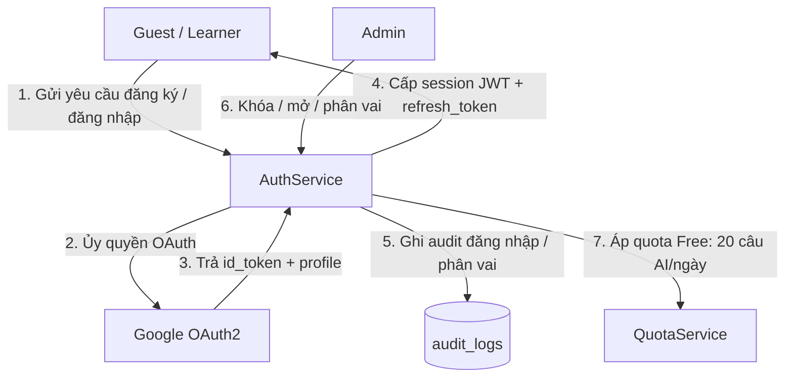
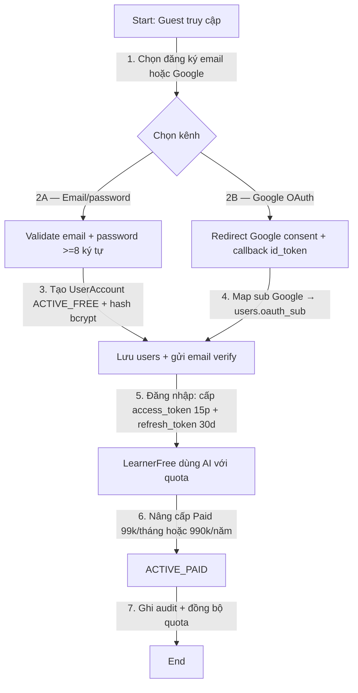
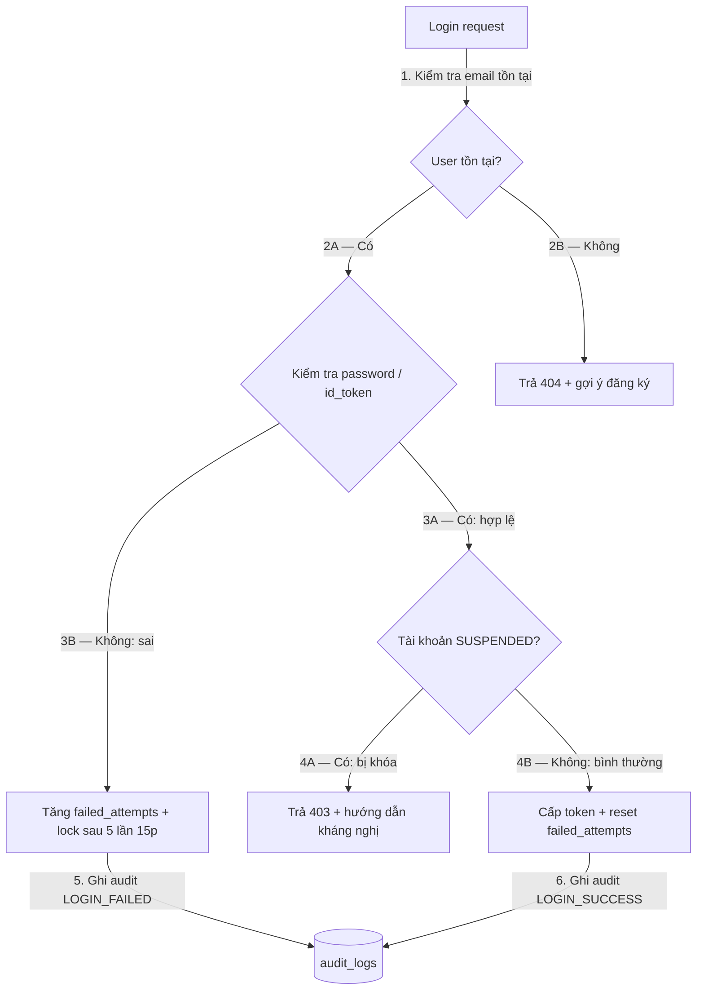

# 01 — Mô Hình Quy Trình Nghiệp Vụ: Xác Thực & Quản Lý Người Dùng

> Module: `auth-user-management` | Múi giờ: `Asia/Ho_Chi_Minh` | Vai trò: `Guest`, `LearnerFree`, `LearnerPaid`, `Admin`

## 1. Mục đích
- Chuẩn hóa luồng đăng ký, đăng nhập (email/password + Google OAuth), quản lý hồ sơ, phân vai, khóa/mở tài khoản và audit.
- Làm đầu vào cho thiết kế API `AuthService`, bảng `users`, `sessions`, `audit_logs`.

## 2. L0 — Sơ đồ ngữ cảnh (Context)

## 3. L1 — Quy trình lõi (Core Process)

## 4. L2 — Ngoại lệ & phục hồi (Exception & Recovery)

## 5. Ghi chú nghiệp vụ
- Password hash `bcrypt(cost=12)`, verify email qua token 24h, refresh rotation chống reuse.
- Google OAuth là đề xuất mặc định; vẫn giữ email/password cho học sinh không có Gmail edu.
- Mọi chuyển trạng thái `GUEST → ACTIVE_FREE → ACTIVE_PAID → SUSPENDED / DELETED` đều ghi `audit_logs(actor, action, target, timestamp)`.
- Xóa tài khoản là soft-delete 30 ngày trước khi purge, giữ audit 12 tháng.
