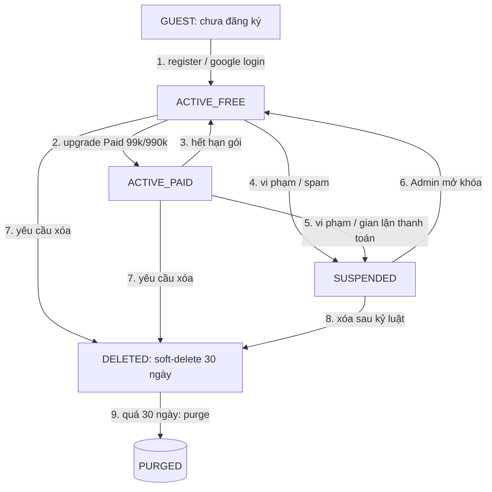

# 04 — Mô Hình Trạng Thái: UserAccount

> Vòng đời chốt: `GUEST → ACTIVE_FREE → ACTIVE_PAID → SUSPENDED / DELETED`. Múi giờ `Asia/Ho_Chi_Minh`.

## 1. Sơ đồ trạng thái

## 2. Bảng chuyển trạng thái

| Từ → Đến | Sự kiện `event` | Điều kiện guard | Hành động |
|----------|-----------------|-----------------|-----------|
| GUEST → ACTIVE_FREE | `REGISTER_SUCCESS` | Email/OAuth hợp lệ | Tạo `users`, init quota Free (20 câu AI/ngày, 10 TL, 50MB) |
| ACTIVE_FREE → ACTIVE_PAID | `SUBSCRIBE_SUCCESS` | Thanh toán OK | Tạo `subscriptions`, mở quota |
| ACTIVE_PAID → ACTIVE_FREE | `SUBSCRIPTION_EXPIRED` | Cron 00:05 | Giữ tài liệu, chặn tính năng Paid |
| * → SUSPENDED | `SUSPEND` | Admin + `reason_code` | Thu hồi JWT/refresh, chặn login 403 |
| SUSPENDED → ACTIVE_* | `UNSUSPEND` | Admin duyệt | Khôi phục trạng thái trước đó |
| * → DELETED | `REQUEST_DELETE` | Xác nhận 2 bước | Ẩn profile, giữ audit 12 tháng |
| DELETED → PURGED | `PURGE_JOB` | Sau 30 ngày | Xóa PII, giữ log ẩn danh |

## 3. Quy tắc
- `PENDING_VERIFY` là cờ phụ của ACTIVE_FREE, không phải state độc lập: `email_verified=false` thì giới hạn 5 câu AI/ngày.
- `failed_attempts >= 5` không đổi state mà khóa tạm `locked_until = now + 15p`.
- Mọi chuyển state ghi `audit_logs(prev_status, new_status, actor, reason)`.
- Không cho `DELETED → ACTIVE_*` (phải đăng ký lại email mới).

## 4. Liên quan phiên học tập
- Khi SUSPENDED/DELETED: `QuotaService` khóa hỏi AI, `DocumentService` chỉ đọc (SUSPENDED) hoặc ẩn (DELETED).
- Khi ACTIVE_PAID hết hạn giữa buổi Quiz AI: cho hoàn thành bài đang làm, bài mới áp quota Free.
