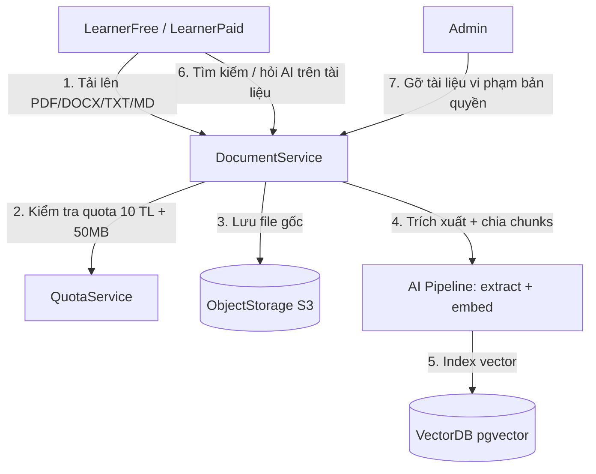
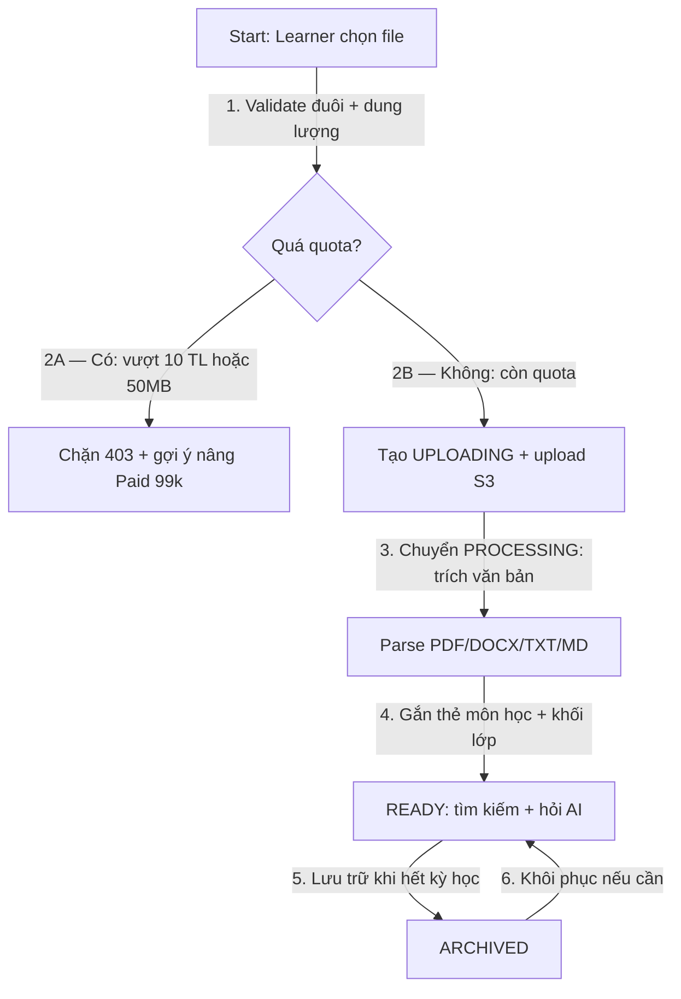
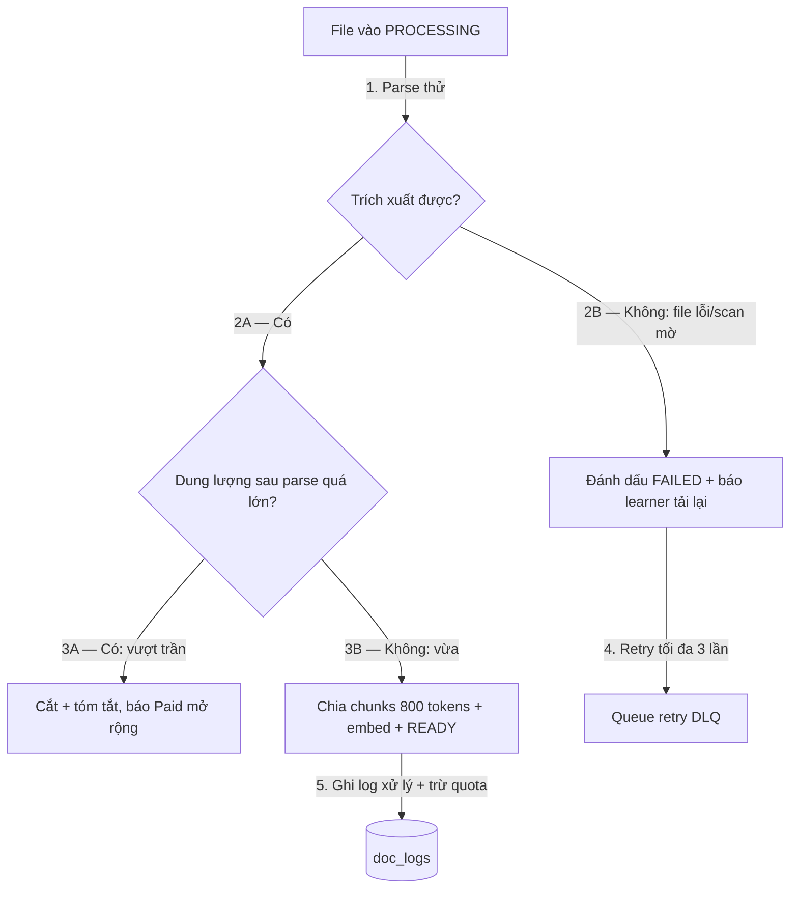

# 01 — Mô Hình Quy Trình Nghiệp Vụ: Quản Lý Tài Liệu Học Tập

> Module: `learning-document` | Định dạng: `PDF/DOCX/TXT/MD` | Quota Free: 10 tài liệu, 50MB | Vòng đời: `UPLOADING→PROCESSING→READY→ARCHIVED/DELETED`

## 1. Mục đích
- Chuẩn hóa tải lên, trích xuất văn bản làm ngữ liệu RAG hỏi AI, gắn thẻ môn học, tìm kiếm, lưu trữ/xóa và quyền riêng tư.
- Đầu vào cho `DocumentService`, bảng `documents`, `doc_chunks`, object storage.

## 2. L0 — Sơ đồ ngữ cảnh (Context)

## 3. L1 — Quy trình lõi (Core Process)

## 4. L2 — Ngoại lệ & phục hồi (Exception & Recovery)

## 5. Ghi chú
- Free: tối đa 10 tài liệu, tổng 50MB, mỗi file ≤ 20MB; Paid mở 500 tài liệu / 5GB.
- TXT/MD parse trực tiếp; PDF/DOCX qua worker async, timeout 5 phút/file.
- Tài liệu mặc định PRIVATE; chia sẻ chỉ qua link lớp học (module sau).
- Mọi thời gian log theo `Asia/Ho_Chi_Minh`.
