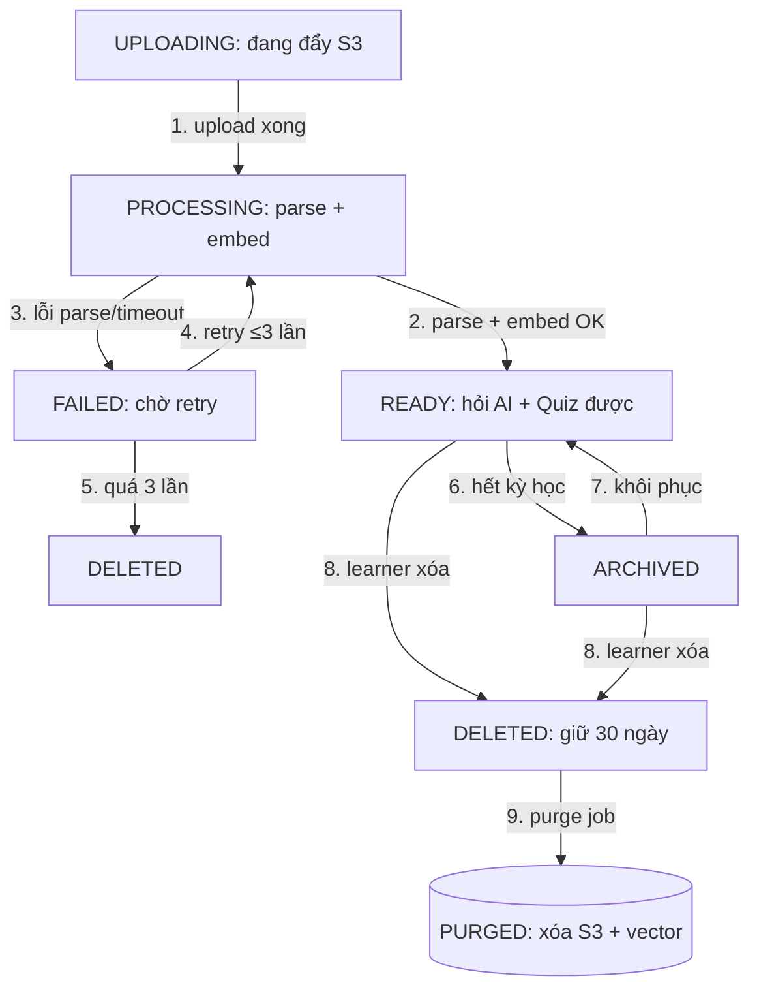

# 04 — Mô Hình Trạng Thái: LearningDocument

> Vòng đời chốt: `UPLOADING → PROCESSING → READY → ARCHIVED / DELETED`, nhánh `FAILED`.

## 1. Sơ đồ

## 2. Bảng chuyển

| Từ → Đến | Sự kiện | Guard | Hành động |
|----------|---------|-------|-----------|
| UPLOADING → PROCESSING | `UPLOAD_DONE` | File đủ bytes, virus-scan sạch | Enqueue worker, set `progress=10%` |
| PROCESSING → READY | `PARSE_OK` | Có text ≥ 50 ký tự | Chia chunks, embed, index vector |
| PROCESSING → FAILED | `PARSE_FAIL` | Lỗi/timeout 5p | Lưu `error_code`, đếm `retry_count` |
| FAILED → PROCESSING | `RETRY` | `retry_count < 3` | Requeue với backoff |
| READY → ARCHIVED | `ARCHIVE` | Learner chủ động | Loại khỏi RAG mặc định |
| ARCHIVED → READY | `RESTORE` | Còn quota | Nạp lại vào retriever |
| * → DELETED | `DELETE` | Xác nhận | Giữ 30 ngày, ẩn khỏi list |
| DELETED → PURGED | `PURGE` | Cron sau 30 ngày | Xóa S3 + `doc_chunks` + vector |

## 3. Quy tắc
- Chỉ READY được RAG hỏi AI / sinh Quiz; UPLOADING/PROCESSING/FAILED hiện progress, chặn hỏi.
- `PROCESSING` quá 5 phút auto-FAILED để tránh kẹt worker mùa ôn thi.
- DELETED của user bị SUSPENDED vẫn purge đúng hẹn.
