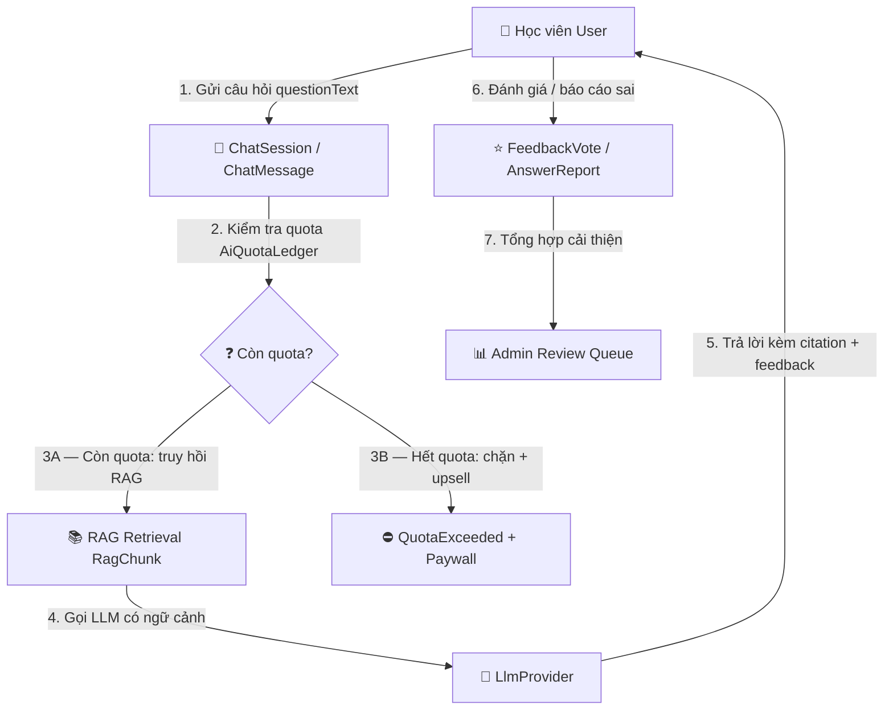
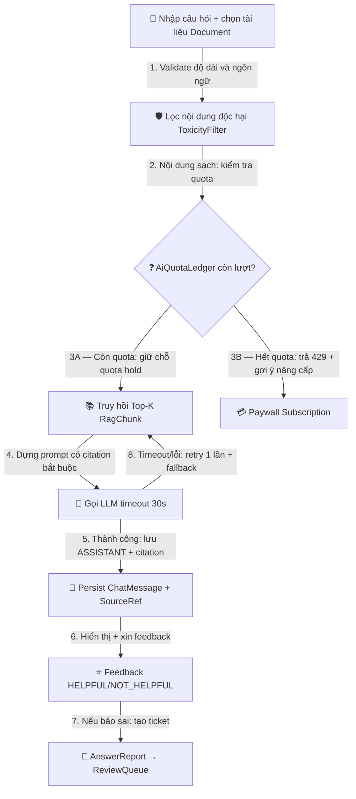
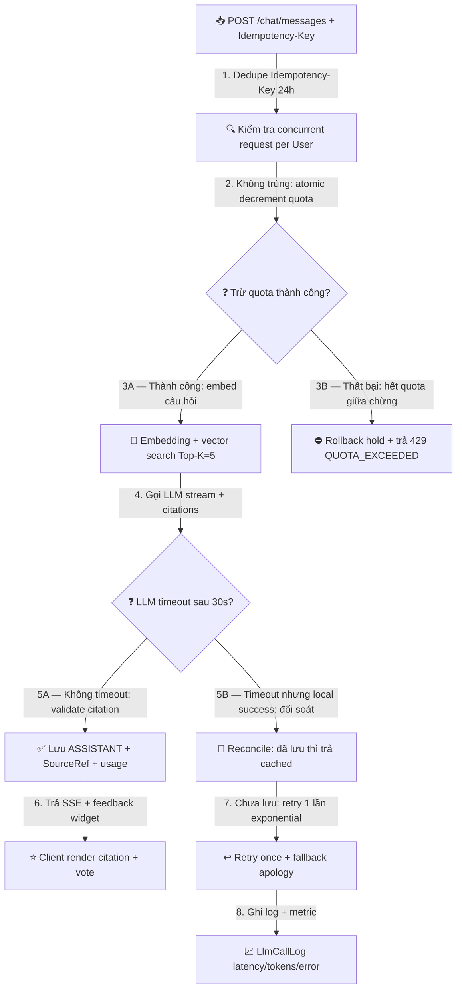

# 01 — Mô Hình Quy Trình Nghiệp Vụ: Gia Sư AI Hỏi Đáp

> Module: `ai-tutor-qa` | Mã nghiệp vụ: `BV-03` | Múi giờ: `Asia/Ho_Chi_Minh` | Quota Free: `20` câu AI/ngày

## 1. Mục đích
- Mô tả luồng hỏi đáp AI theo ngữ cảnh tài liệu (RAG): hỏi → kiểm tra quota → truy hồi → gọi LLM → trích dẫn nguồn → đánh giá.
- Làm căn cứ cho Use Case, Business Rule, State Model và kiểm thử.
- Ngăn hallucination, lạm dụng quota, nội dung độc hại và lỗi retry/timeout.

## 2. Thuật ngữ và định danh
| Thuật ngữ | Identifier | Ghi chú |
|---|---|---|
| Phiên hỏi đáp | `ChatSession` | Một chủ đề hội thoại của `User` |
| Tin nhắn hỏi | `ChatMessage` (role=`USER`) | Câu hỏi của học viên |
| Tin nhắn đáp | `ChatMessage` (role=`ASSISTANT`) | Câu trả lời của AI |
| Bản ghi quota | `AiQuotaLedger` | Trừ quota theo ngày `Asia/Ho_Chi_Minh` |
| Đoạn trích nguồn | `RagChunk` | Chunk từ `Document` + `Embedding` |
| Đánh giá hữu ích | `FeedbackVote` | `HELPFUL` / `NOT_HELPFUL` |
| Báo cáo sai | `AnswerReport` | Học viên báo câu trả lời sai |

## 3. Quy trình L0 — Toàn cảnh (End-to-End)

## 4. Quy trình L1 — Luồng nghiệp vụ chi tiết

## 5. Quy trình L2 — Xử lý kỹ thuật sâu (quota, idempotency, fallback)

## 6. Ma trận trách nhiệm RACI
| Hoạt động | User | AiTutorService | LlmProvider | Admin |
|---|---|---|---|---|
| Gửi câu hỏi | R | A | — | — |
| Kiểm tra/trừ quota | — | R/A | — | — |
| Truy hồi RAG | — | R | — | — |
| Gọi LLM | — | R | R | — |
| Duyệt AnswerReport | — | — | — | R/A |

## 7. Ghi chú kiểm soát
- Mọi mũi tên L0/L1/L2 đã đánh số; nhánh dùng hậu tố A/B.
- `Idempotency-Key` bắt buộc cho POST message để chống double-charge quota khi retry.
- Citation bắt buộc khi câu trả lời dựa trên tài liệu; nếu không đủ ngữ cảnh phải thú nhận.
