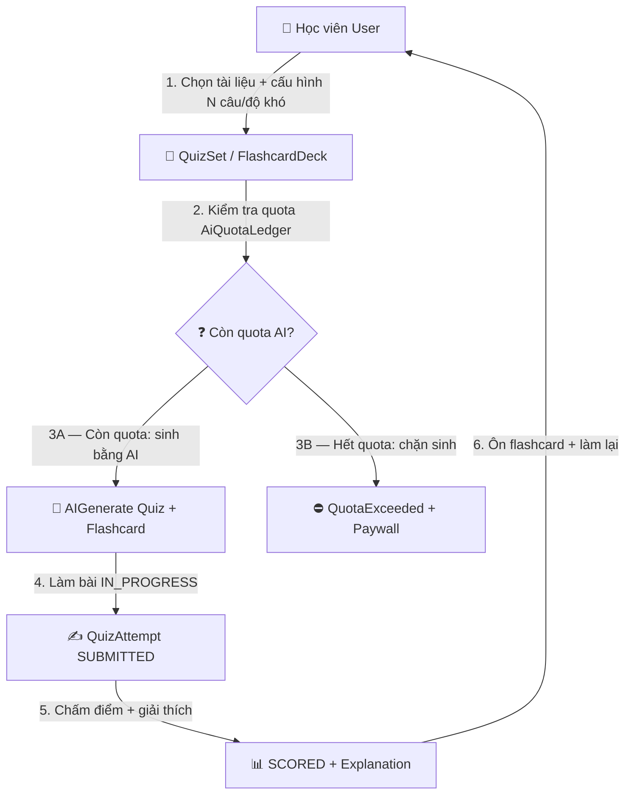
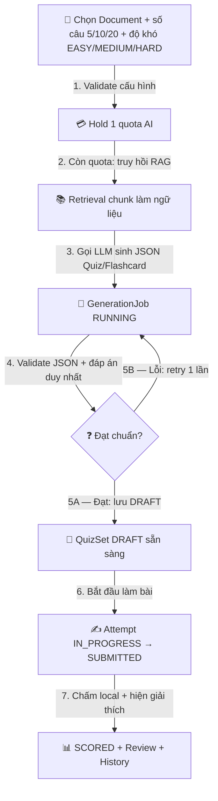
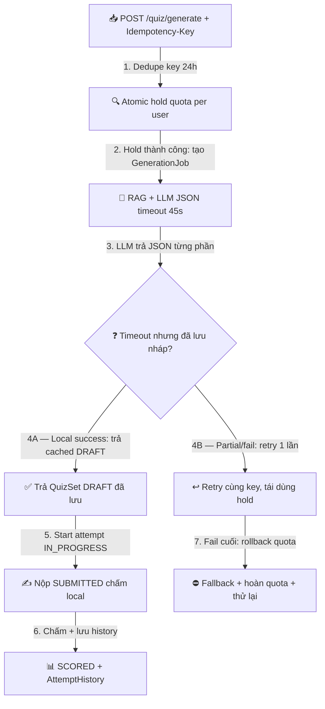

# 01 — Mô Hình Quy Trình Nghiệp Vụ: Luyện Tập Quiz & Flashcard

> Module: `quiz-flashcard` | Mã: `BV-04` | Múi giờ: `Asia/Ho_Chi_Minh` | Quota Free: `20` lượt AI/ngày (dùng chung ledger với BV-03)

## 1. Mục đích
- Mô tả vòng đời sinh Quiz trắc nghiệm + Flashcard từ `Document` bằng AI và làm bài `DRAFT → IN_PROGRESS → SUBMITTED → SCORED`.
- Làm căn cứ cho Use Case, Business Rule, State Model và kiểm thử.
- Kiểm soát quota sinh đề, hallucination đáp án, retry sinh dở dang, concurrent nộp bài.

## 2. Thuật ngữ và định danh
| Thuật ngữ | Identifier | Ghi chú |
|---|---|---|
| Bộ đề | `QuizSet` | Gồm N `QuizQuestion`, có `difficulty`, `questionCount` |
| Lượt làm bài | `QuizAttempt` | Trạng thái DRAFT→IN_PROGRESS→SUBMITTED→SCORED |
| Câu hỏi | `QuizQuestion` | Trắc nghiệm 4 lựa chọn + `explanation` |
| Thẻ ghi nhớ | `Flashcard` / `FlashcardDeck` | Mặt trước/sau + `SM2` ôn tập |
| Lượt AI | `AiQuotaLedger` | Sinh đề/flashcard tốn quota; làm bài không tốn |
| Bản sinh dở | `GenerationJob` | Job sinh AI bất đồng bộ, retry được |

## 3. Quy trình L0 — Toàn cảnh

## 4. Quy trình L1 — Sinh đề và làm bài

## 5. Quy trình L2 — Kỹ thuật sâu (idempotency, partial, concurrent)

## 6. Ma trận RACI
| Hoạt động | User | QuizService | LlmProvider | Admin |
|---|---|---|---|---|
| Cấu hình + sinh đề | R | A | R | — |
| Kiểm tra/trừ quota | — | R/A | — | — |
| Làm bài + nộp | R | A | — | — |
| Chấm + giải thích | — | R/A | — | — |
| Duyệt câu sai | — | — | — | R/A |

## 7. Ghi chú kiểm soát
- Sinh đề/flashcard tốn 1 quota AI/lần (không tính theo số câu); làm bài, xem giải thích, làm lại MIỄN PHÍ.
- Nộp bài dùng `attemptVersion` chống double-submit concurrent.
