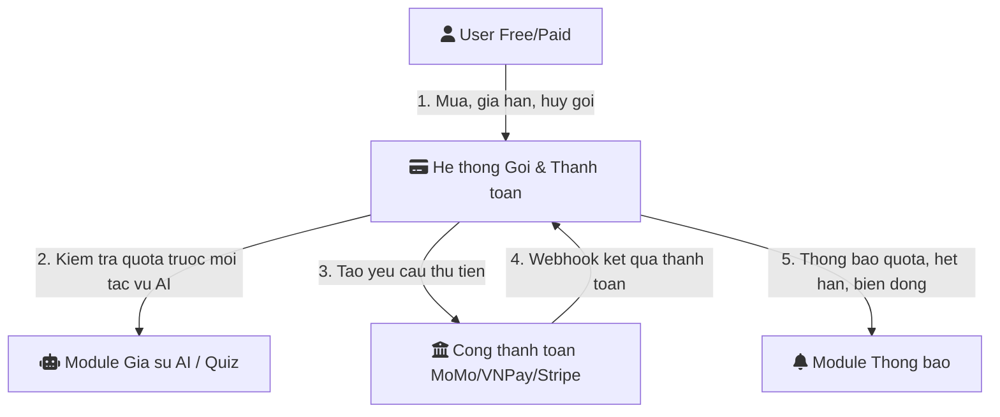
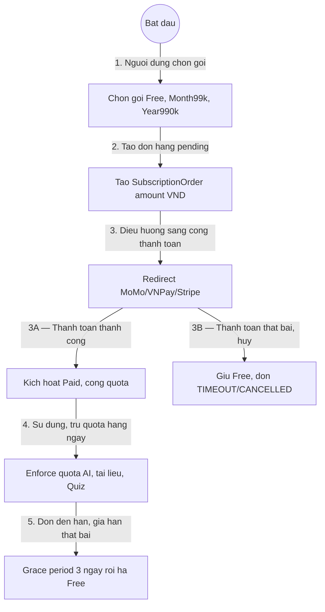
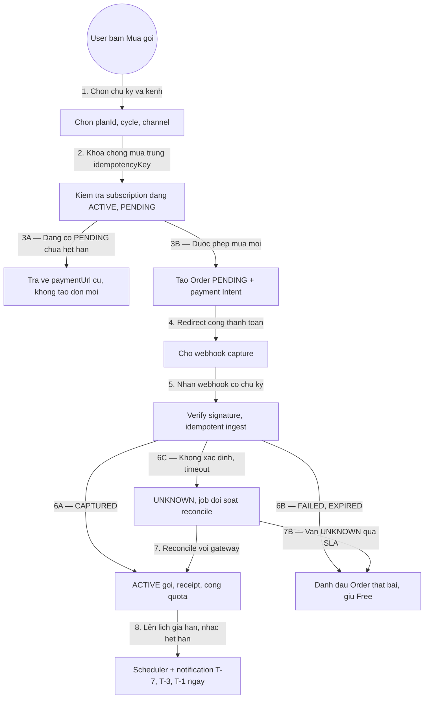

# 01 — Mô Hình Quy Trình Nghiệp Vụ: Gói Dịch Vụ, Thanh Toán Và Hạn Mức

> Module: `05-goi-dich-vu-thanh-toan-va-han-muc` | Múi giờ: `Asia/Ho_Chi_Minh` | Tiền tệ: `VND` | Cắt ngày quota: `00:00`

## 1. Mục đích
- Mô tả vòng đời gói dịch vụ: dùng Free ➔ mua/gia hạn Paid ➔ kiểm soát quota ➔ hết hạn/grace ➔ hủy/hoàn tiền.
- Làm đầu vào cho tính tiền, webhook, đối soát và thông báo.

## 2. L0 — Bối cảnh (Context)

## 3. L1 — Quy trình chính

## 4. L2 — Chi tiết mua gói + webhook + đối soát

## 5. Quy ước chung
- `cutoffTime = 00:00 Asia/Ho_Chi_Minh`; quota ngày reset lúc cutoff.
- `gracePeriodDays = 3` sau `expiresAt`, trong grace giữ quyền Paid nhưng chặn gia hạn chồng.
- Mọi số tiền lưu `amountVnd` (số nguyên, đơn vị đồng), không dùng số thập phân.
- Mọi tạo đơn mua dùng `Idempotency-Key` của client + `orderCode` duy nhất phía server.
