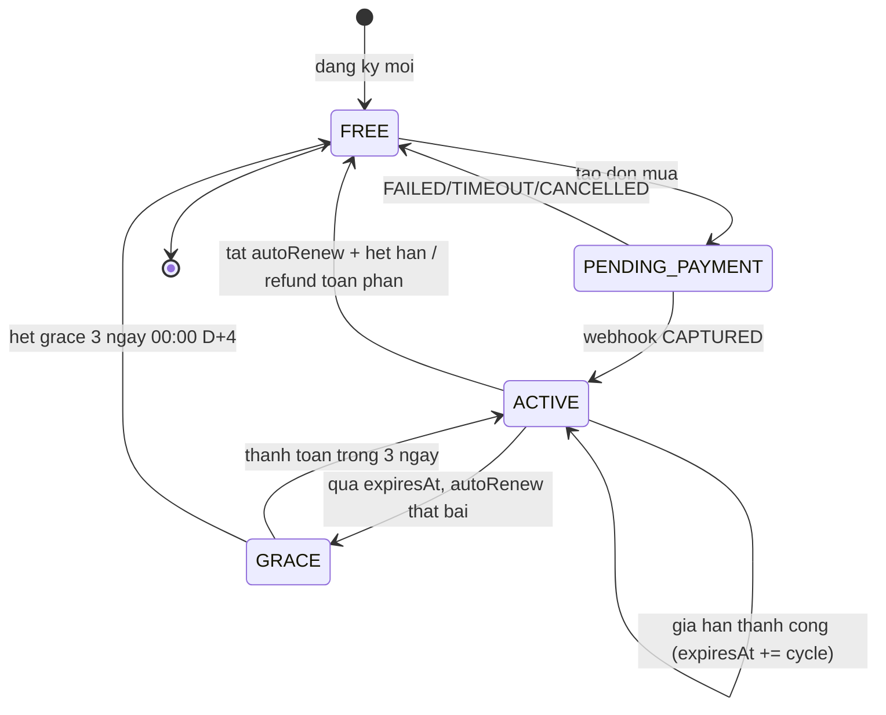
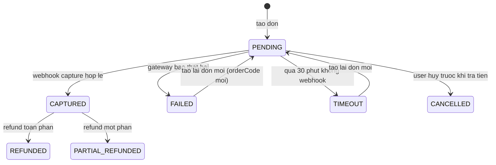

# 04 — Mô Hình Trạng Thái: Gói Dịch Vụ, Thanh Toán Và Hạn Mức

> Hai máy trạng thái: `Subscription` và `SubscriptionOrder`. Múi giờ `Asia/Ho_Chi_Minh`.

## 4.1 Subscription (gói của user)

| Từ ➔ Đến | Sự kiện | Hành động |
| :--- | :--- | :--- |
| `FREE ➔ PENDING_PAYMENT` | `createOrder` | Khóa mua chồng theo `userId` |
| `PENDING_PAYMENT ➔ ACTIVE` | `paymentCaptured` | Set `planId`, `startedAt`, `expiresAt`, cộng quota |
| `ACTIVE ➔ GRACE` | `expiresAt passed` | Giữ quyền 3 ngày, gửi nhắc gia hạn |
| `GRACE ➔ FREE` | `graceExpired` | Hạ gói, reset quota Free, ghi timeline |
| `ACTIVE ➔ FREE` | `refundFull` | Thu hồi quyền Paid ngay lập tức |

## 4.2 SubscriptionOrder (đơn thanh toán)

## 4.3 Quy tắc chuyển đổi
- Chỉ `CAPTURED` mới được sinh `Receipt`; `FAILED/TIMEOUT/CANCELLED` không sinh receipt.
- `REFUNDED/PARTIAL_REFUNDED` là trạng thái cuối, không chuyển tiếp thêm.
- `UNKNOWN` không phải trạng thái lưu DB mà là cờ `reconcileStatus=UNKNOWN` trên đơn `PENDING`.
- Mọi chuyển đổi ghi `SubscriptionEventLog` gồm `fromStatus`, `toStatus`, `actor`, `reason`, `occurredAt`.
