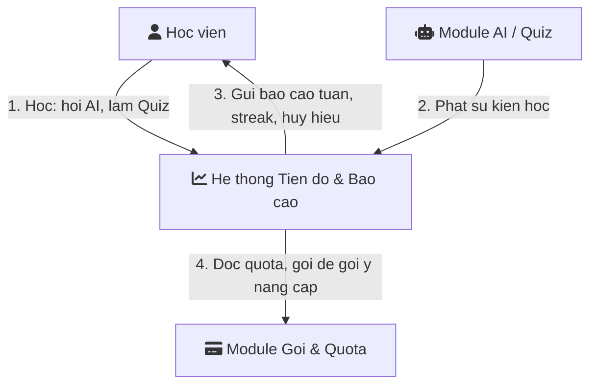
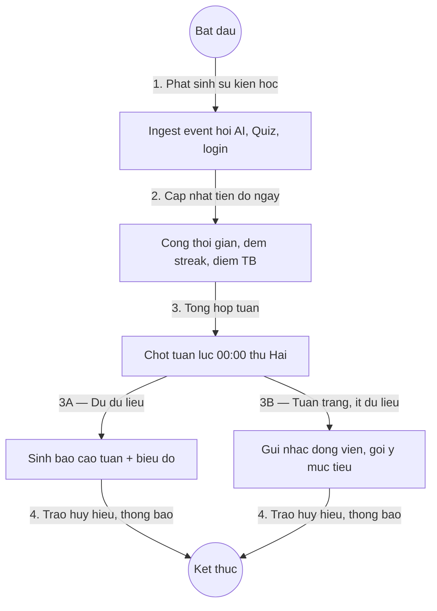
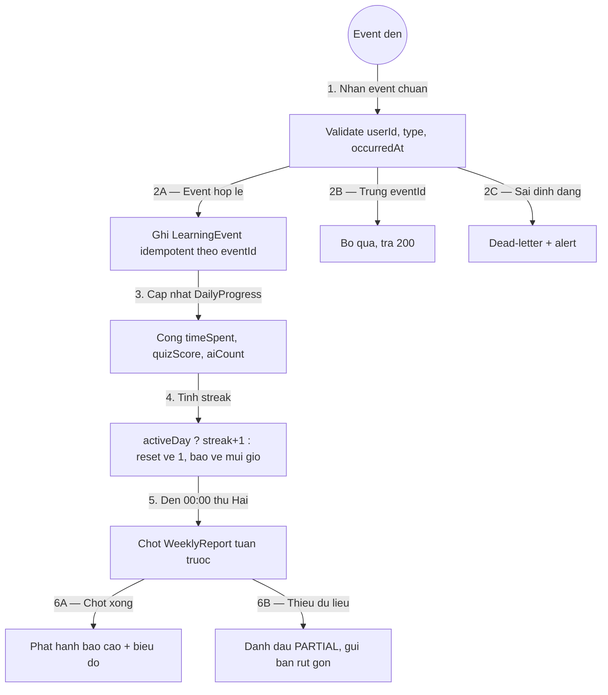

# 01 — Mô Hình Quy Trình Nghiệp Vụ: Theo Dõi Tiến Độ Và Báo Cáo

> Module: `06-theo-doi-tien-do-va-bao-cao` | Ưu tiên P1, phân tích ở mức MVP cơ bản | Múi giờ `Asia/Ho_Chi_Minh`

## 1. Mục đích
- Ghi nhận sự kiện học (hỏi AI, Quiz, streak, thời gian, điểm) ➔ tổng hợp báo cáo tuần + biểu đồ tiến bộ.
- Tạo động lực duy trì thói quen, làm đầu vào upsell Paid (module 05).

## 2. L0 — Bối cảnh

## 3. L1 — Quy trình chính

## 4. L2 — Chi tiết ingest + streak + chốt tuần

## 5. Quy ước chung
- Ngày học tính từ `00:00–23:59:59 Asia/Ho_Chi_Minh`; `activeDay = timeSpent >= 5 phút OR >= 1 Quiz OR >= 3 câu AI`.
- Tuần MVP: Thứ Hai–Chủ Nhật; chốt báo cáo `00:00 thứ Hai`, gửi trước 08:00.
- Mọi event có `eventId` duy nhất để ingest idempotent; sự kiện đến muộn ≤ 7 ngày vẫn được cộng bù.
