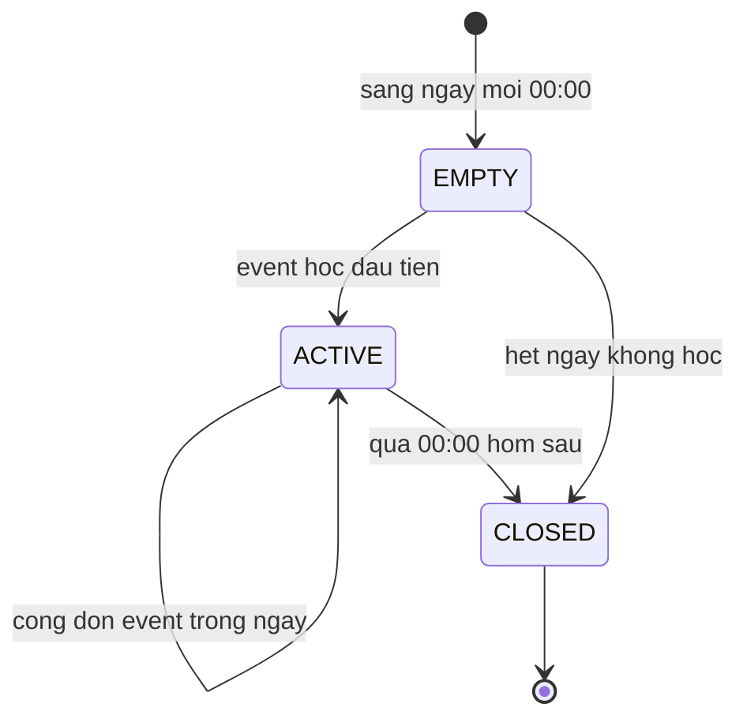
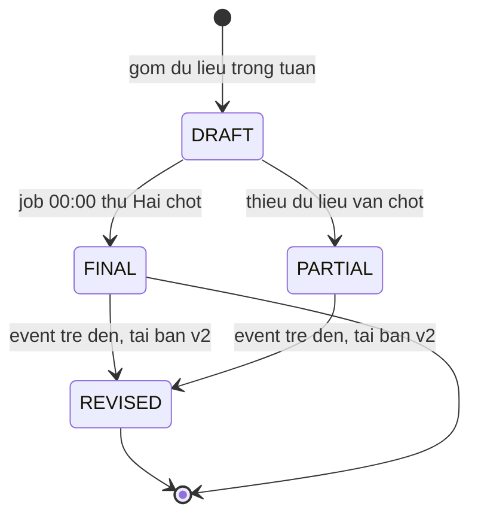

# 04 — Mô Hình Trạng Thái: Theo Dõi Tiến Độ Và Báo Cáo

> Máy trạng thái cho `DailyProgress` và `WeeklyReport`. Múi giờ `Asia/Ho_Chi_Minh`.

## 4.1 DailyProgress (một ngày của user)

| Từ ➔ Đến | Điều kiện | Ghi chú |
| :--- | :--- | :--- |
| `EMPTY ➔ ACTIVE` | `timeSpent >= 1s` hoặc bất kỳ event nào | Ngày bắt đầu có hoạt động |
| `ACTIVE` tự cộng dồn | Mỗi event mới | `timeSpent += duration`, quiz/điểm TB cập nhật |
| `➔ CLOSED` | Job 00:15 chốt ngày | Sau CLOSED chỉ sửa bằng bù trễ (tái tính) |

## 4.2 WeeklyReport (báo cáo tuần T2–CN)

## 4.3 Quy tắc
- `streak` tăng khi ngày `CLOSED` có `activeDay = true`; ngắt 1 ngày trống ➔ reset.
- `WeeklyReport` chốt rồi là bất biến, chỉ tạo bản `REVISED v2, v3...`, không sửa bản cũ.
- Mọi tái tính ghi `RecalcLog(userId, date, reason, at)` để truy vết số liệu.

## 4.4 Ví dụ vòng đời streak
- T2–T6 mỗi ngày học ≥ 5 phút ➔ `streak` tăng 1→5; T7 nghỉ (EMPTY➔CLOSED, không active) ➔ CN học lại reset về 1.
- Học 23:55 T2 đến 00:05 T3: tách 2 `DailyProgress` (5 phút T2, 5 phút T3) — cả 2 ngày đều active nếu đủ ngưỡng.
- Event trễ 2 ngày đổ về ngày gốc làm ngày đó từ không-active thành active ➔ tính lại streak các ngày sau, phát hành `REVISED` nếu tuần đã chốt.

## 4.5 Ví dụ vòng đời WeeklyReport
- Tuần 01–07/09: job 00:00 08/09 chốt `FINAL v1` (học 5/7 ngày, 320 phút, điểm TB 75%).
- 09/09 event trễ của 06/09 đến ➔ tái tính ➔ `REVISED v2` (340 phút, TB 76%), bản v1 giữ nguyên để đối chiếu.
- Tuần không học ngày nào ➔ vẫn sinh báo cáo dạng động viên (không để trống gây hoang mang).
