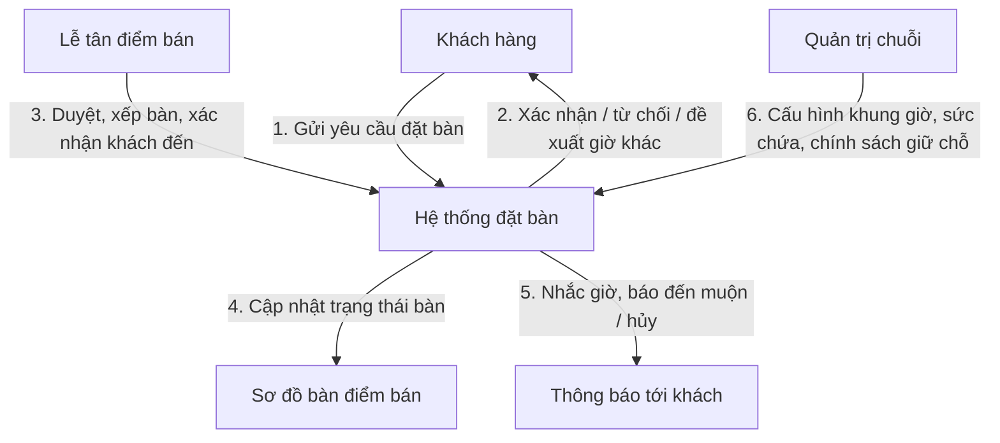
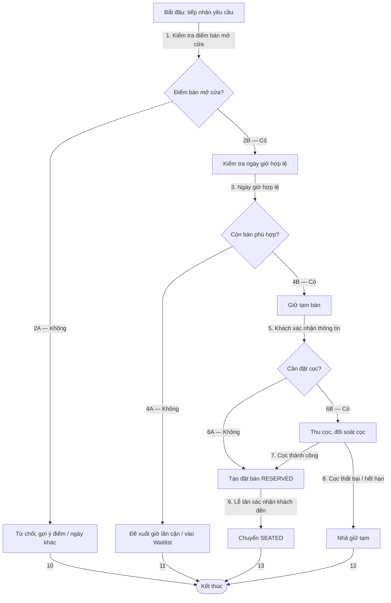
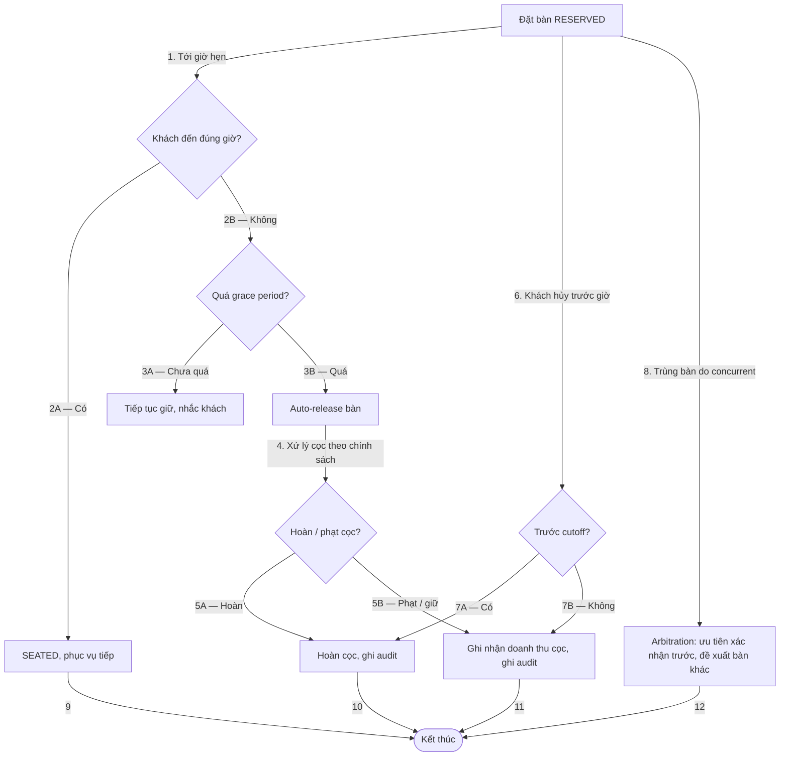

# Mô Hình Quy Trình Nghiệp Vụ Đặt Bàn (01-mo-hinh-quy-trinh-nghiep-vu.md)

Vị trí: `specs/01-app-nha-hang/03-phan-tich-sau/01-dat-ban/01-mo-hinh-quy-trinh-nghiep-vu.md`
Phạm vi: Chuỗi Tier Lớn, kênh Ăn tại chỗ + Đặt bàn trước, 4 nền tảng.
Mọi chính sách số liệu (phút giữ bàn, giờ hủy) là `PROPOSED`, chờ User chốt ở `06-danh-sach-quyet-dinh.md`.

## 1. L0 — Context Flow

## 2. L1 — Core Process Flow

## 3. L2 — Exception & Recovery Flow

## 4. Ghi chú đọc sơ đồ

- Edge đánh số thứ tự thực thi. Nhánh A / B ghi rõ điều kiện.
- `grace period`, `cutoff`, chính sách cọc chưa chốt số, đang là `PROPOSED` ở tệp quy tắc.
- Concurrent hai lễ tân cùng xếp một bàn được xử lý ở nhánh 8 của L2, chi tiết arbitration ở A2 sâu hơn.
