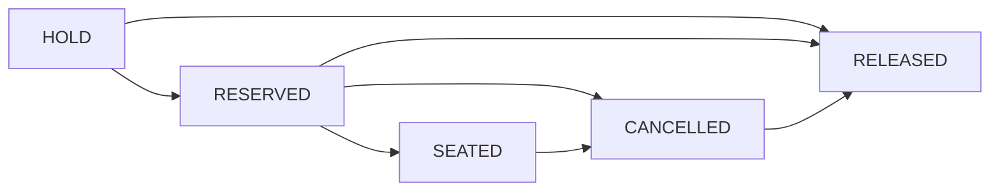

# Mô Hình Trạng Thái Đặt Bàn (04-mo-hinh-trang-thai.md)

Vị trí: `specs/01-app-nha-hang/03-phan-tich-sau/01-dat-ban/04-mo-hinh-trang-thai.md`
Mã trạng thái dùng tiếng Anh. Mọi transition chưa chốt guard số liệu đều là `PROPOSED`.

| Từ | Tới | Actor | Guard đề xuất | Tác động |
| :--- | :--- | :--- | :--- | :--- |
| `HOLD` | `RESERVED` | `customer`, `system` | Xác nhận thông tin, cọc xong nếu cần | Bàn chuyển giữ chính thức |
| `HOLD` | `RELEASED` | `system` | Hết hạn giữ tạm / cọc fail | Bàn về pool trống |
| `RESERVED` | `SEATED` | `receptionist` | Khách đến trong grace | Bàn `OCCUPIED`, cho tạo đơn |
| `RESERVED` | `CANCELLED` | `customer`, `receptionist` | Yêu cầu hủy hợp lệ | Kích hoạt xử lý cọc |
| `RESERVED` | `RELEASED` | `system` | Quá grace không đến | Auto-release, xử lý cọc |
| `CANCELLED` | `RELEASED` | `system` | Hoàn / phạt cọc xong | Đóng vòng đời, ghi audit |

Cấm: `SEATED` quay về `HOLD`, `RELEASED` là trạng thái kết thúc không chuyển tiếp.
