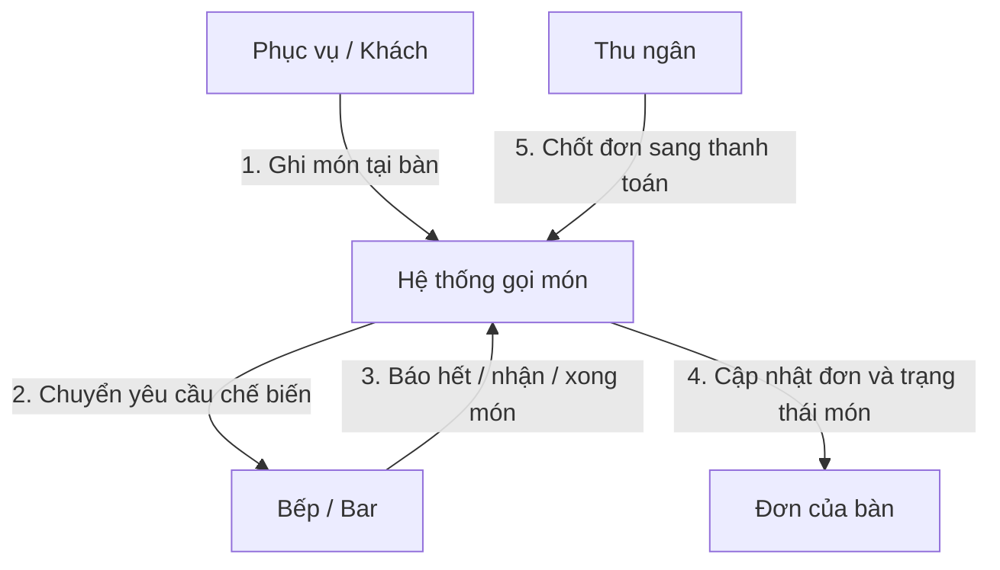
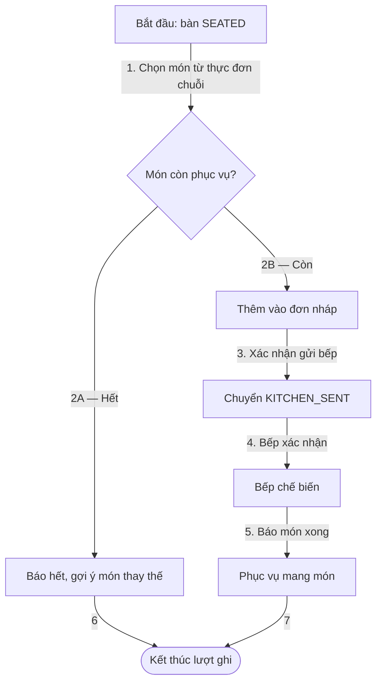
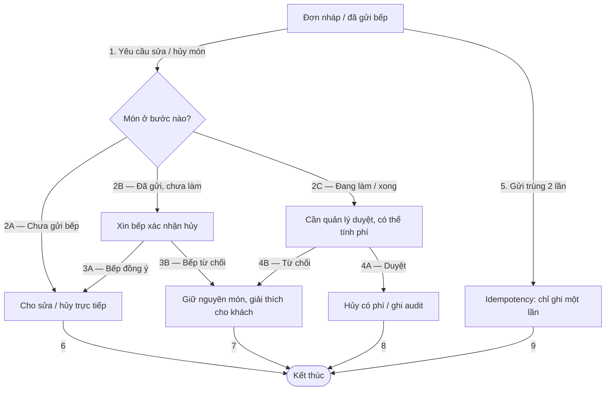

# Mô Hình Quy Trình Gọi Món Tại Bàn (01-mo-hinh-quy-trinh-nghiep-vu.md)

Vị trí: `specs/01-app-nha-hang/03-phan-tich-sau/02-goi-mon-tai-ban/01-mo-hinh-quy-trinh-nghiep-vu.md`
Tiền đề: bàn đã `SEATED` từ đặt bàn. Fine dining, Tablet / POS và Mobile khách cùng ghi món.

## 1. L0 — Context Flow

## 2. L1 — Core Process Flow

## 3. L2 — Exception & Recovery Flow

Ngưỡng sửa / hủy ở L2 nhánh 2 đang là `PROPOSED`, chờ DEC-O01.
