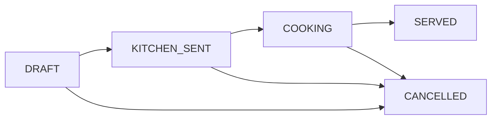

# Mô Hình Trạng Thái Món (04-mo-hinh-trang-thai.md)

Vị trí: `specs/01-app-nha-hang/03-phan-tich-sau/02-goi-mon-tai-ban/04-mo-hinh-trang-thai.md`

| Từ | Tới | Guard đề xuất | Trạng thái |
| :--- | :--- | :--- | :--- |
| `DRAFT` sang `CANCELLED` | Phục vụ tự hủy | PROPOSED, chờ DEC-O01 |
| `KITCHEN_SENT` sang `CANCELLED` | Bếp xác nhận chưa làm | PROPOSED |
| `COOKING` / `SERVED` sang `CANCELLED` | Quản lý duyệt, có thể tính phí | PROPOSED |

Cấm tạo đơn khi bàn chưa `SEATED`.
