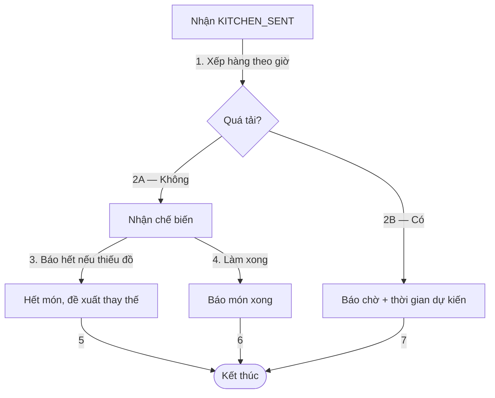

# Điều Phối Bếp / Bar (03-dieu-phoi-bep gộp lõi)

Vị trí: `specs/01-app-nha-hang/03-phan-tich-sau/03-dieu-phoi-bep/`

## 01-flowchart

```mermaid
flowchart TB
    A["Sự cố bếp"] -->|"1. Món lỗi / khách chê"| B{"Làm lại?"}
    B -->|"2A — Có"| C["Ưu tiên làm lại"]
    B -->|"2B — Không"| D["Hủy có duyệt + audit"]
    A -->|"3. Mất kết nối màn hình"| E["Chuyển giấy tạm, đồng bộ lại"]
    C -->|"4"| F(["Kết thúc"])
    D -->|"5"| F
    E -->|"6"| F
```

## 02-06-use-case-quy-tac-quyet-dinh
- UC: nhận món, báo hết, báo xong, làm lại. Trạng thái `KITCHEN_SENT` → `COOKING` → `READY` → `SERVED`.
- BR-P01 PROPOSED: hủy sau `COOKING` cần quản lý duyệt, đồng bộ với DEC-O01 đã chốt chặt.
- DEC-K01 UNRESOLVED (P1): có cho bếp tự báo hết và khóa món theo điểm tạm thời không, hay cần quản lý duyệt? Đề xuất: cho bếp khóa tạm, quản lý xem lại.

## 07-19-du-lieu-lien-module-truy-vet-backlog
- Dữ liệu: hàng chờ theo điểm, thời gian chờ, món hết, món làm lại.
- Liên module: nhận từ gọi món, trả trạng thái cho phục vụ và thanh toán.
- Backlog: màn hình bếp theo điểm, báo hết một chạm, ưu tiên làm lại.
