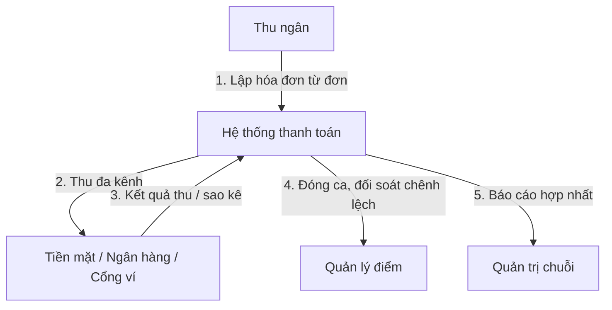
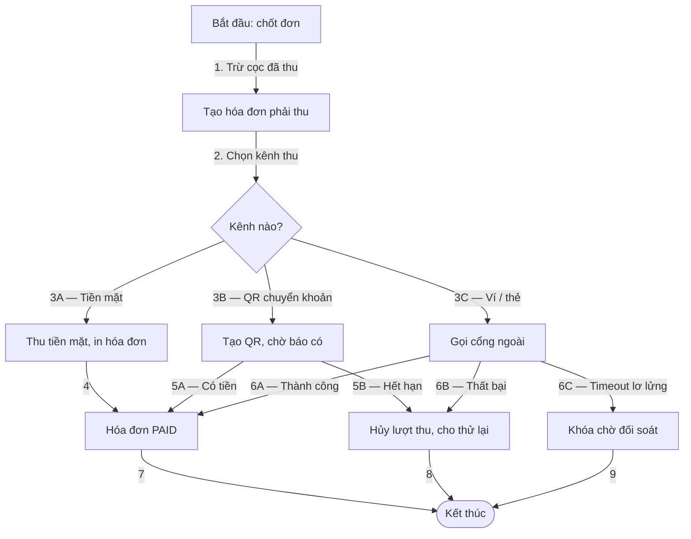
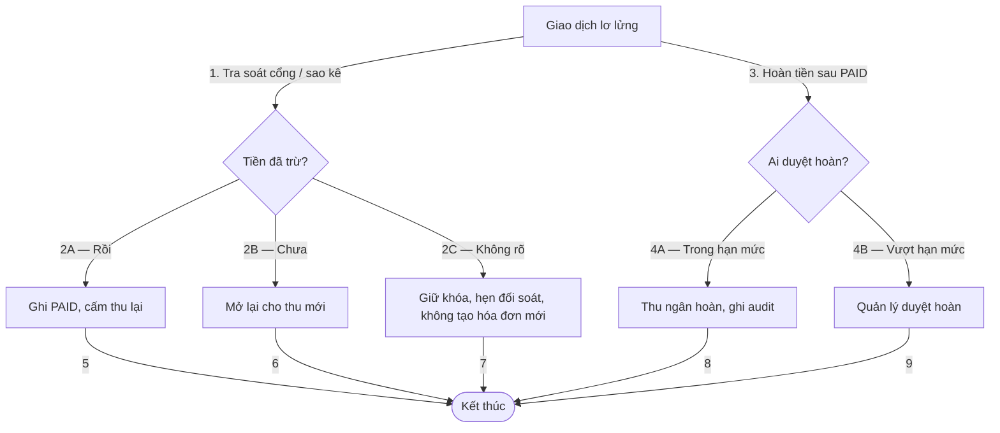

# Mô Hình Thanh Toán Và Đối Soát (01-mo-hinh-quy-trinh-nghiep-vu.md)

Vị trí: `specs/01-app-nha-hang/03-phan-tich-sau/04-thanh-toan-doi-soat/01-mo-hinh-quy-trinh-nghiep-vu.md`
Phạm vi: 3 kênh tiền mặt + QR chuyển khoản + ví / thẻ, cọc đã thu trừ vào hóa đơn, đối soát ca điểm bán.

## 1. L0 — Context Flow

## 2. L1 — Core Process Flow

## 3. L2 — Exception & Recovery Flow

Chính sách khóa chờ ở L1 nhánh 6C và L2 đang là `PROPOSED`, chờ DEC-P01.
