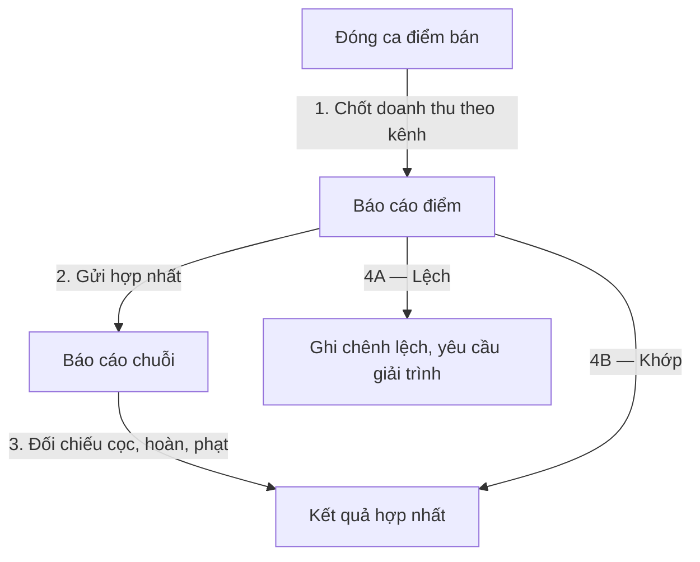

# Báo Cáo Chuỗi (05-bao-cao-chuoi gộp lõi)

Vị trí: `specs/01-app-nha-hang/03-phan-tich-sau/05-bao-cao-chuoi/`

## Flowchart

## Use case / Quy tắc / Quyết định
- UC: báo cáo điểm, báo cáo hợp nhất, giải trình chênh lệch.
- BR-D01 PROPOSED: không hợp nhất khi còn ca chưa đóng hoặc còn `PENDING_REVIEW` chưa bàn giao.
- DEC-B01 UNRESOLVED (P1): chốt báo cáo theo ngày kinh doanh (tới 2h sáng) hay ngày dương lịch? Đề xuất: ngày kinh doanh.
